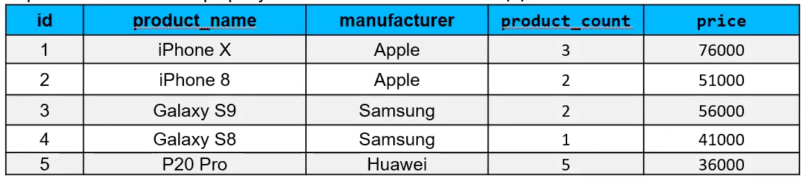

# SQL. Семинар 1. Домашнее задание

1. Создайте таблицу с мобильными телефонами (mobile_phones), используя графический интерфейс. Заполните БД данными. Добавьте скриншот на платформу в качестве ответа на ДЗ

2. Выведите название, производителя и цену для товаров, количество которых превышает 2

3.  Выведите весь ассортимент товаров марки “Samsung”

4. (по желанию)* С помощью регулярных выражений найти:
- 4.1. Товары, в которых есть упоминание "Iphone"
- 4.2. Товары, в которых есть упоминание "Samsung"
- 4.3.  Товары, в которых есть ЦИФРЫ
- 4.4.  Товары, в которых есть ЦИФРА "8"
